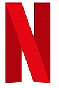

# Netflix: UI Clone 🎬
<p align="center">
	
</p>

## 📖 Sobre
Página inicial da **Netflix** desenvolvido durante o Bootcamp **HTML Web Developer** da **Digital Innovation One**, utilizando HTML semântico, além de flexbox e media queries para um design responsivo.

---

## 🚀 Tecnologias e ferramentas utilizadas
- **HTML5**
- **CSS3**
- **jQuery** (com [Owl Carousel 2](https://owlcarousel2.github.io/OwlCarousel2/))

---

## 🖥️ Demonstração

<p align="center">
	
</p>

---

## 🔧 Como executar o projeto
```bash
# Clone o repositório
git clone https://github.com/brunocs90/netflix_ui_clone.git

# Entre no diretório
cd netflix-ui-clone
```

Abra o arquivo index.html em qualquer navegador

---

## 📝 Licenças

O projeto está, sob a licença MIT. Para saber mais, acesse o arquivo [LICENSE](https://github.com/brunocs90/netflix_ui_clone/blob/main/LICENSE).

---
**Desenvolvido por [Bruno César](https://github.com/brunocs90).**
