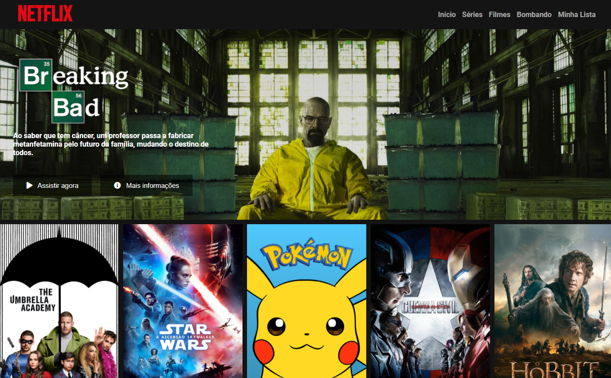

# Netflix: UI Clone 🎬
<p align="center">
  <a href="#sobre">Sobre</a>&nbsp;&nbsp;&nbsp;|&nbsp;&nbsp;&nbsp;
  <a href="#tecnologias">Tecnologias</a>&nbsp;&nbsp;&nbsp;|&nbsp;&nbsp;&nbsp;
  <a href="#executar">Executar</a>&nbsp;&nbsp;&nbsp;|&nbsp;&nbsp;&nbsp;
  <a href="#licença">Licença</a>
</p>

<p align="center">
	
</p>

<h2><a id="sobre" class="anchor" aria-hidden="true" href="#sobre">📖 Sobre</a></h2>

Página inicial da **Netflix** desenvolvido durante o Bootcamp **HTML Web Developer** da **Digital Innovation One**, utilizando HTML semântico, além de flexbox e media queries para um design responsivo.

---

<h2><a id="tecnologias" class="anchor" aria-hidden="true" href="#tecnologias">🚀 Tecnologias</a></h2>
<ul>
<li><a href="https://www.w3schools.com/html/" rel="nofollow">HTML</a></li>
<li><a href="https://sass-lang.com/" rel="nofollow">SASS</a></li>
<li><a href="https://developer.mozilla.org/pt-BR/docs/Web/JavaScript" rel="nofollow">JavaScript</a></li>
</ul>

---

<h2><a id="executar" class="anchor" aria-hidden="true" href="#executar">🔧 Como executar o projeto</a></h2>
 
```bash
# Clone o repositório
git clone https://github.com/brunocs90/netflix_ui_clone.git

# Entre no diretório
cd netflix-ui-clone
```

Abra o arquivo index.html em qualquer navegador

---

<h2><a id="licença" class="anchor" aria-hidden="true" href="#licença">📝 Licença</a></h2>

O projeto está, sob a licença MIT. Para saber mais, acesse o arquivo [LICENSE](https://github.com/brunocs90/netflix_ui_clone/blob/main/LICENSE).

---
**Desenvolvido por [Bruno César](https://github.com/brunocs90).**
